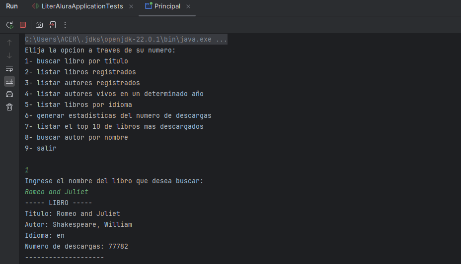

# Practicando Spring Boot: Challenge LiterAlura 📚

En este emocionante desafío de programación, creé mi propio catálogo de libros: el **LiterAlura**. Aprendí a realizar
solicitudes a una API de libros, a manipular datos JSON, guardarlos en una base de datos y, finalmente, a filtrar y
mostrar los libros y autores de interés.

### Pasos Seguidos:

1. **Configuración del Ambiente Java**
    - Preparé mi entorno de desarrollo Java para comenzar el proyecto.

2. **Creación del Proyecto**
    - Inicié un nuevo proyecto en Spring Boot para el LiterAlura.

3. **Consumo de la API**
    - Utilicé una API de libros para obtener datos sobre diferentes títulos y autores.

4. **Análisis de la Respuesta JSON**
    - Procesé la respuesta JSON de la API para extraer la información relevante.

5. **Inserción y Consulta en la Base de Datos**
    - Guardé los datos obtenidos en una base de datos local para almacenamiento persistente.

6. **Exhibición de Resultados a los Usuarios**
    - Desarrollé una interfaz de usuario para que los usuarios puedan buscar y visualizar libros y autores según sus
      intereses.

### ¡Explorando el Mundo de los Libros con LiterAlura! 🌟

